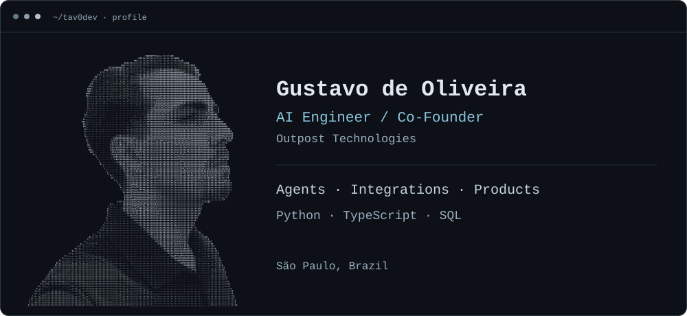

<picture>
  <source media="(max-width: 600px)" srcset="./assets/profile-mobile.svg">
  <source media="(max-width: 1100px)" srcset="./assets/profile-compact.svg">
  
</picture>

# Gustavo de Oliveira

**AI Engineer building agents, integrations, and the products around them.**

I started with AWS data pipelines and APIs at Compass.UOL. At Neuronz, I built a clinic CRM with AI-powered WhatsApp service and automated AMEVO integration. Today, I'm an AI Engineer and co-founder at Outpost Technologies, building an omnichannel CRM and the agent workflows around it.

My work connects the application, the agent, and the data layer: turning customer workflows into features, controlling what agents can do, and keeping context traceable to its source.

[LinkedIn](https://www.linkedin.com/in/tav0dev/) · [Email](mailto:gusdeoliveira.dev@gmail.com) · [AWS certification](https://www.credly.com/badges/9b2689d5-5b74-434a-8c99-440c1fe6e0b9)

## Selected work

**Outpost Technologies — AI Engineer & Co-Founder**

Building a multitenant CRM with Next.js, TypeScript and Supabase, connecting messaging channels, contact history and sales workflows. Implemented policy-controlled OpenAI replies, encrypted interactions and structured contact memory.

Developed integrations with the upstream [QM agent harness](https://github.com/yc-software/qm) and [GBrain memory system](https://github.com/garrytan/gbrain), with signed task capabilities, OAuth/MCP access and human-approved knowledge exports. The complete QM/GBrain workflow is implemented and awaiting end-to-end validation.

[Architecture and contribution](./docs/outpost-crm-case.md)

**Neuronz / Instituto Tournieux — AI Engineer**

Built and delivered a clinic CRM connecting WhatsApp service, appointments, tasks and patient records. Implemented AI customer support, automated AMEVO read/write integration, and clinic automations with configurable response behavior, interaction history and scheduling/handoff alerts.

**Bico — Co-Founder**

Co-founded and built a Flutter/Supabase product for micro and small businesses, connecting AI-assisted marketing, social publishing and customer follow-up. Implemented goal-based social post assistance, follow-up and birthday-message automations, and four automation cadences.

The product has **3 paying customers** and was selected for **Phase 2 of Centelha SP 3**.

[Product scope and contribution](./docs/bico-case.md) · [Flutter source](https://github.com/tav0dev/bico-flutter)

**Compra Fácil — Technology & Product Partner**

Lead product and technology for a local-commerce marketplace supporting orders and deliveries through app, WhatsApp and phone channels.

[Public website source](https://github.com/tav0dev/compra-facil-site)

**Applied AI research — First author**

Co-authored a proposal for food-waste reduction combining data ingestion, predictive and prescriptive models, explainability and cloud architecture. Published in *Perspectiva em Educação, Gestão & Tecnologia*, v. 14, n. 28 (2025).

[Read the paper](https://fatecitapetininga.edu.br/academico/perspectiva/pdf/28/e28artigo%20%2829%29.pdf)

## How I build

- **AI & agents:** OpenAI APIs, structured outputs, agent workflows, retrieval, contextual memory and MCP integration.
- **Applications & data:** Python, TypeScript, React, Next.js, Node.js, REST APIs, SQL, PostgreSQL and Supabase.
- **Cloud:** AWS Glue / Lambda / Athena / S3 / QuickSight, Vercel and Cloudflare Workers.

## Background

Systems Analysis and Development at **FATEC Itapetininga** — expected December 2026. Studying Applied AI Engineering at **UniPDS / Anhanguera**. Technical diploma from **IFSP Itapetininga**, completed July 2025.

**AWS Certified Cloud Practitioner** · Portuguese native · English B2 · Based in Brazil, available for relocation and business travel.

Interested in AI engineering roles involving agents, integrations and product delivery. [Get in touch](mailto:gusdeoliveira.dev@gmail.com).
