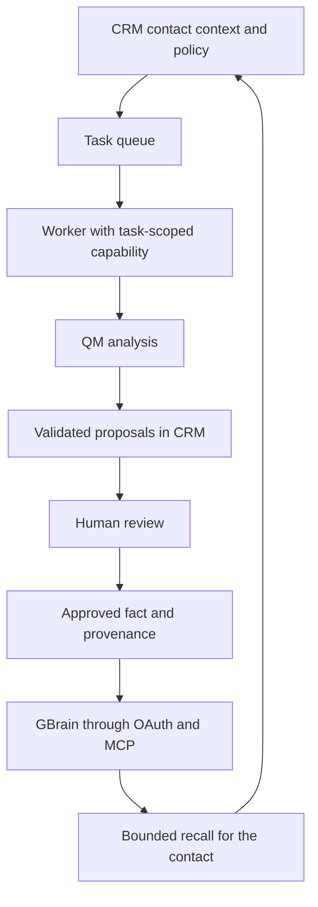

# Outpost CRM — agent integration

I build an omnichannel CRM that connects customer interactions to contact history and sales workflows. The agent integration extends that application with contact analysis, follow-up drafts and curated memory, controlled by the CRM's permissions and review process.

## My contribution

I implemented the CRM-side integration and task worker, and adapted deployment layers for the upstream QM agent harness and GBrain memory system. The application uses Next.js, TypeScript and Supabase, with encrypted interaction history and structured contact facts that retain references to their source events.

The worker uses signed, short-lived capabilities limited to a task. It sends scoped context to QM, validates structured results, and returns proposals for review. It handles deadlines and retries, and rejects ephemeral context when the selected harness would persist it.

The CRM mediates OAuth/MCP access to GBrain. Each organization has a source binding, and approved facts carry provenance. Credentials remain with the server. Knowledge export checks the contact policy and human approval before writing.

## A follow-up workflow

For a synthetic contact who requests a demo, the agent can propose a short brief, a follow-up draft and a fact recording the request. A reviewer decides what to approve. An approved fact can then be exported and recalled for subsequent analysis.

The conversational reply path is a separate CRM component using OpenAI, with reply and approval policies. The QM worker produces proposals; the CRM governs any subsequent effects.

## Upstream attribution

- [Comp AI CRM](https://github.com/trycompai/crm/tree/d585dc3b1b3b1cc6d991efebf81311b8538644f2): adapted agent patterns and evidence scoring; four reference skill documents retained unchanged.
- [QM](https://github.com/yc-software/qm/tree/0f0e0adccce2d13e4aff3e5bf3efb0cccf312f7a): upstream agent harness with Outpost deployment layers and CRM client integration.
- [GBrain](https://github.com/garrytan/gbrain/tree/9afbf4a09a0ca861c0014736d440eb07796bfc92): upstream memory engine with Outpost deployment policy and a CRM OAuth/MCP integration.

The QM and GBrain engine code remains unchanged relative to these pinned bases. My contribution is the product integration and deployment adaptation.

## Validation and stage

During the October 2026 portfolio review, 22 existing CRM unit tests passed, covering task permissions, organization bindings, export approval, memory feature gates and context budgeting. External services were mocked.

The integration is implemented; complete live QM/GBrain validation remains pending in the deployment documentation reviewed. These checks do not measure production latency, answer quality or business impact. The product repositories are private; this case describes the architecture without customer records or operational credentials.
